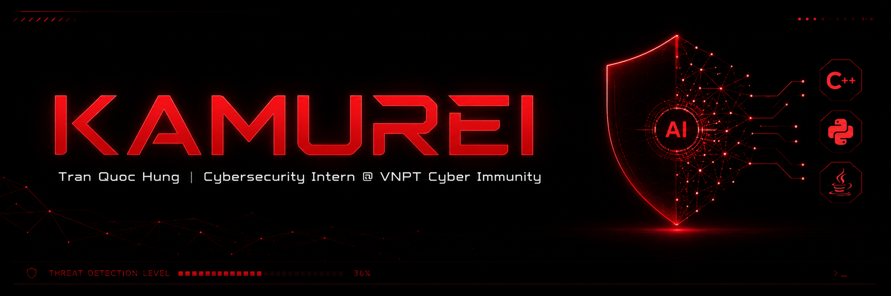

## Hi there! 👋 I'm Tran Quoc Hung (you guys can call me Kamureii or Rei), a Network Security Intern @ VCI.

🚀 I am a highly motivated Information Systems student at VNU-UET with a strong computer science foundation. My journey is all about diving deep into Cybersecurity, particularly Endpoint Security (EDR/EPP) and Agentic AI, while building robust, scalable applications.

👨‍💻 Currently, I'm honing my skills as an intern at VNPT Cyber Immunity (VCI), where I research detection mechanisms, develop behavioral test cases for mimikatz-like activities, and build advanced network tools.

🛠️ My tech toolkit includes **C++, Python, Java, NodeJS, ExpressJS, SQL, and MFC**. I bridge the gap between low-level network programming and full-stack development, utilizing tools like Git, Docker, and Wireshark to ensure seamless deployment and analysis.

🔐 Cybersecurity concepts? Yep, I've got you covered. From Network & Application Security to basic Forensics and Vulnerability Management, I am always eager to learn, test, and implement secure solutions in real-world environments.

🧠 When it comes to problem-solving, my analytical mindset shines through. Whether it's engineering a multi-threaded network port scanner using Python sockets or designing log management interfaces, I love breaking down complex technical matters into efficient, functional code.

Let's connect and build the future together! 🌟

### Top Skills & Tools:
     

### My Featured Projects 💻
* **SentinelNet Port Scanner:** An advanced multi-threaded network scanning tool built in Python for detecting service vulnerabilities with high speed and accuracy.
* **Security Event Logger:** A collaborative system (Java, SQL, MFC) for aggregating and analyzing security logs from multiple network devices, featuring efficient filtering and searching.
* **E-Commerce Web Platform:** A complete online store platform deployed locally using Docker containers for scalable testing (Node.js, Express.js, MySQL).

---

* 🔭 I’m currently working as **Cybersecurity Intern @ VNPT Cyber Immunity**
* 🌱 I’m currently exploring **Agentic AI & Next-Gen EDR/XDR Solutions**
* 👯 I’m looking to collaborate on **Cybersecurity research labs or Open-source security tools**
* 💬 Ask me about **Network Programming, Endpoint Security, and Fullstack Development**
* 📫 How to reach me: **kamurei123@gmail.com** or via **[LinkedIn](https://www.linkedin.com/in/kamureii/)**

### Github Stats 📈

